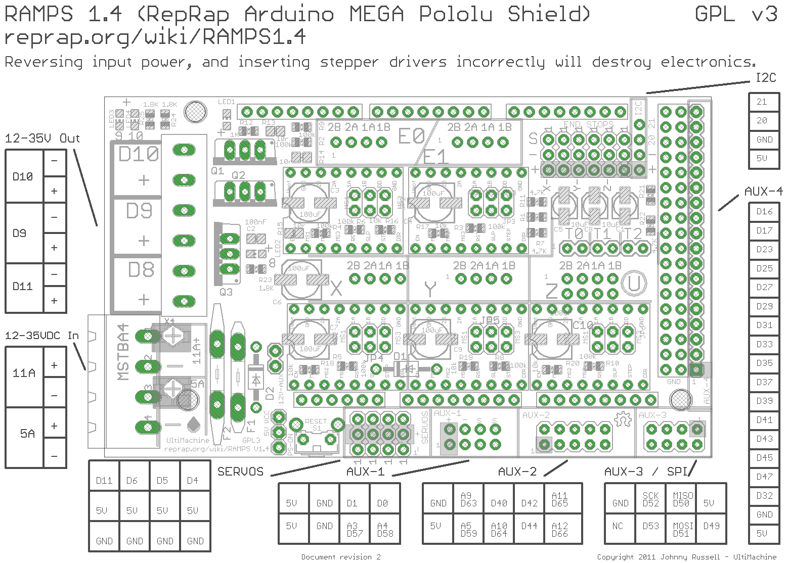

This repo is a fork of Marlin.

This repo is used to store information about the Autodesk Escher Gemini 3D printer's electronics, firmware, software, and user interface.

## Electronics Layout


## Terminal Blocks
There are 3 terminal blocks on the back of Gemini. One for each bot, and one for distributing 24V.  
A description of how each terminal block is wired can be found in the file Gemini-Cables.xlsx

## Ramps Boards
Both Bot1 and Bot2's motors are controlled by their own dedicated microcontroller and electronics shield, known as a RAMPS board. The firmware for each of the boards is nearly identical. The firmware can be "burned" onto each board using [Arduino software](https://www.arduino.cc/). The individual configuration for Bot1 and Bot2 can be found at Marlin/Configuration_bot1.h and Marlin/Configuration/bot2.h, respectively.  

When burning firmware onto Bot1 or Bot2, you must specify which board in the firmware files. To specify configuration for either Bot1 or Bot2, you will need to modify Marlin/MarlinConfig.h line 30 from 
```
#include "Configuration.h"
```
to
```
#include "Configuration_bot1.h"
```
or
```
#include "Configuration_bot2.h"
```

## Ramps Peripherals
 - 24V connector - The green, 4 pin connector is where 24 volts DC are applied to the Ramps board. The 24 volts are used for the extruder motor driver, the extruder heater, and the fan(s). ***NOTE*** Ramps boards are normally constructed to handle only 12 volts. For them to operate at 24 volts, remove diodes D1 and D2. 
 - USB connector - Each ramps board is connected to its own raspberry pi. Gcode commands are streamed to the ramps board from the raspberry pi and status reports such as position and temperature can be sent back from the ramps board to the raspberry pi. Because the 24 volt and usb (5 volt) signals are isolated, the ramps board's logic (including turning on fans, heaters, and holding torque on motors) will not operate without voltage supplied via the usb port.
 - Limit Switches - The board has locations for mounting X, Y, and Z limit switches. Each axis has a position for mounting a "Min" and "Max" limit switch. Bot1 utilizes X-Min, Y-Max, and Z-Max. Bot2 utilizes X-Max and Y-Max.  

Bot 1 Limit switch plugs:   

Bot 2 Limit switch plugs:   
 - Thermistor - Each board is reading the temperature from its nozzle's heating element via a thermistor. The thermistor is plugged into the Ramps Board's T0 connector.  

Bot 1 Thermistor plug:   

Bot 2 Thermistor plug:   

 - X, Y, Z stepper motor signals - The step, enable, direction, and ground signals from each axis are sent to leadshine motor drivers in order to drive the motors. The pins are organized by a single block. Instructions on assembling this block are available [here](https://www.thingiverse.com/thing:2595024).  
 - Extruder Stepper Driver - Unlike the X, Y, and Z axes, the extruder motor is driven by the DRV8825 chip which is connected directly to the ramps board. 
   - ***Extruder Stepper Voltage***
The extruder stepper motors are driven by the DRV8825 chip. They are set at approximately 0.450 volts. It is easiest to tune these chips using a ceramic phillips head screwdriver. A video for tuning the extruder stepper motors can be found [here](https://www.youtube.com/watch?feature=player_embedded&v=89BHS9hfSUk).


 - Extruder and Fan pins - 24 volts is sent to the extruder heater and fan(s) via output 8, 9, and 10 on the ramps board.

## EStop and Collision Shutdown Switches
- The 24 Volt power supply is controlled via a relay. In case of an emergency or collision, the 24 volt supply is disconnected from power via the relay. This immediately disables the motors, heaters, and fans on both bots.
  - The router, raspberry pis, and ramps 5V logic will not be interrupted when the 24V supply is disconnected.
  - We've noticed that sometimes the 24V supply has difficulty re-engaging / powering back on. Triggering the collision switch can help re-engage the power supply.
- EStop
  - In case of an emergency, push the red button. This will disable the 24V supply.
- Collision Switch
  - In case of a collision between Bot1 and Bot2, the first point of contact is a Normally-Closed limit switch. Closing this switch disables the 24V supply.
## Raspberry Pis
There are 3 Raspberry pis. One for conducting, one for controlling Bot1 and one for controlling Bot2. Each is running MCU software. Additional copies of this software, as well as instructions on installation and usage can be found at the Autodesk Machine Collaboration Utility Github repo here.

## Tuning X / Y offset on Bot2
The offset between Bot1 and Bot2 should be tuned from the MCU page of Gemini-bot2 or by tuning the firmware limits of Bot2. Tuning the offset is described in detail [here](https://github.com/Autodesk/machine-collaboration-utility/wiki/06---Calibration)

## Tuning the print bed to be flat
With Bot2 homed in X, jog Bot1 between positions [X5 Y5 Z0] and [X495 Y5 Z0] to ensure that the bed is perfectly flat. The bed can be tuned by turning the screws below on the left and right to raise or lower the bed. Ideally, the screws should leave the springs in the center of their range of motion. Once the left and right sides of the bed have been tuned, jog the nozzle on Bot1 to position [X260 Y370 Z0] and tune the bed to be flush with the nozzle at this point, by turning the screw in the back center of the print bed as needed.

## Mechanically tuning Z offset on Bot1 and Bot2
Each bot's nozzle is expected to sit flush with the bed when the bed is set at Z0. This can be tuned by turning the screw directly above the nozzle, where turning clockwise raises the nozzle. Once the position is set, then tighten the locking nut.

## Accessing the MCU Pages for Bot1, Bot2, and Conductor
When a new image of MCU is created, the bot can be found at http://mcu.local. To find the MCU page, you must be on the same network as the raspberry pi. The hostname of the pi can be changed to something unique by visiting the "Settings" top menu of MCU and selecting "Update Hostname". Ideally, each bot should be located at the following endpoints:
 - The Conductor - http://gemini.local
 - Bot1 - http://gemini-bot1.local
 - Bot2 - http://gemini-bot2.local

## Printing a .gcode file
1. Visit the endpoint for either bot1 or bot2. 
2. Connect the bot, by clicking on the "connect" button.
3. Upload a file using the file upload form.
4. Click on the "Play" icon on the file and then select the bot you have connected to to print the file.

## Printing a .esh file
1. Visit the endpoint for the conductor (should be http://gemini.local)
2. Make sure your bots are all listed as described [here](https://github.com/Autodesk/machine-collaboration-utility/wiki/07---Setting-up-Conductor)
3. Upload your sliced .esh file  
4. Click on the "Play" icon on the file and then select the Conductor, in order to print the file.

# Marlin 3D Printer Firmware


### END OF GEMINI / ESCHER DOCUMENTATION

## Marlin 1.1

Marlin 1.1 represents an evolutionary leap over Marlin 1.0.2. It is the result of over two years of effort by several volunteers around the world who have paid meticulous and sometimes obsessive attention to every detail. For this release we focused on code quality, performance, stability, and overall user experience. Several new features have also been added, many of which require no extra hardware.

For complete Marlin documentation click over to the [Marlin Homepage <marlinfw.org>](http://marlinfw.org/), where you will find in-depth articles, how-to videos, and tutorials on every aspect of Marlin, as the site develops. For release notes, see the [Releases](https://github.com/MarlinFirmware/Marlin/releases) page.

## Stable Release Branch

This Release branch contains the latest tagged version of Marlin (currently 1.1.3 – June 2017).

Previous releases of Marlin include [1.0.2-2](https://github.com/MarlinFirmware/Marlin/tree/1.0.2-2) (December 2016) and [1.0.1](https://github.com/MarlinFirmware/Marlin/tree/1.0.1) (December 2014). Any version of Marlin prior to 1.0.1 (when we started tagging versions) can be collectively referred to as Marlin 1.0.0.

## Contributing to Marlin

Click on the [Issue Queue](https://github.com/MarlinFirmware/Marlin/issues) and [Pull Requests](https://github.com/MarlinFirmware/Marlin/pulls) links above at any time to see what we're currently working on.

To submit patches and new features for Marlin 1.1 check out the [bugfix-1.1.x](https://github.com/MarlinFirmware/Marlin/tree/bugfix-1.1.x) branch, add your commits, and submit a Pull Request back to the `bugfix-1.1.x` branch. Periodically that branch will form the basis for the next minor release.

Note that our "bugfix" branch will always contain the latest patches to the current release version. These patches may not be widely tested. As always, when using "nightly" builds of Marlin, proceed with full caution.

## Current Status: In Development

Marlin development has reached an important milestone with its first stable release in over 2 years. During this period we focused on cleaning up the code and making it more modern, consistent, readable, and sensible.

## Future Development

Marlin 1.1 is the last "flat" version of Marlin!

Arduino IDE now has support for folder hierarchies, so Marlin 1.2 will have a [hierarchical file structure](https://github.com/MarlinFirmware/Marlin/tree/breakup-marlin-idea). Marlin's newly reorganized code will be easier to work with and form a stronger starting-point as we get into [32-bit CPU support](https://github.com/MarlinFirmware/Marlin/tree/32-Bit-RCBugFix-new) and the Hardware Access Layer (HAL).

[](https://scan.coverity.com/projects/2224)
[](https://travis-ci.org/MarlinFirmware/Marlin)

## Marlin Resources

- [Marlin Home Page](http://marlinfw.org/) - The Marlin Documentation Project. Join us!
- [RepRap.org Wiki Page](http://reprap.org/wiki/Marlin) - An overview of Marlin and its role in RepRap.
- [Marlin Firmware Forum](http://forums.reprap.org/list.php?415) - Find help with configuration, get up and running.
- [@MarlinFirmware](https://twitter.com/MarlinFirmware) on Twitter - Follow for news, release alerts, and tips & tricks. (Maintained by [@thinkyhead](https://github.com/thinkyhead).)

## Credits

The current Marlin dev team consists of:
 - Roxanne Neufeld [[@Roxy-3D](https://github.com/Roxy-3D)] - English
 - Scott Lahteine [[@thinkyhead](https://github.com/thinkyhead)] - English
 - Bob Kuhn [[@Bob-the-Kuhn](https://github.com/Bob-the-Kuhn)] - English
 - Andreas Hardtung [[@AnHardt](https://github.com/AnHardt)] - Deutsch, English
 - Nico Tonnhofer [[@Wurstnase](https://github.com/Wurstnase)] - Deutsch, English
 - Jochen Groppe [[@CONSULitAS](https://github.com/CONSULitAS)] - Deutsch, English
 - João Brazio [[@jbrazio](https://github.com/jbrazio)] - Portuguese, English
 - Bo Hermannsen [[@boelle](https://github.com/boelle)] - Danish, English
 - Bob Cousins [[@bobc](https://github.com/bobc)] - English
 - [[@maverikou](https://github.com/maverikou)]
 - Chris Palmer [[@nophead](https://github.com/nophead)]
 - [[@paclema](https://github.com/paclema)]
 - Erik van der Zalm [[@ErikZalm](https://github.com/ErikZalm)]
 - David Braam [[@daid](https://github.com/daid)]
 - Bernhard Kubicek [[@bkubicek](https://github.com/bkubicek)]

More features have been added by:
 - Alberto Cotronei [[@MagoKimbra](https://github.com/MagoKimbra)] - English, Italian
 - Thomas Moore [[@tcm0116](https://github.com/tcm0116)]
 - Ernesto Martinez [[@emartinez167](https://github.com/emartinez167)]
 - Petr Zahradnik [[@clexpert](https://github.com/clexpert)]
 - Kai [[@Kaibob2](https://github.com/Kaibob2)]
 - Edward Patel [[@epatel](https://github.com/epatel)]
 - F. Malpartida [[@fmalpartida](https://github.com/fmalpartida)] - English, Spanish
 - [[@esenapaj](https://github.com/esenapaj)] - English, Japanese
 - [[@benlye](https://github.com/benlye)]
 - [[@Tannoo](https://github.com/Tannoo)]
 - [[@teemuatlut](https://github.com/teemuatlut)]
 - [[@bgort](https://github.com/bgort)]
 - Luc Van Daele[[@LVD-AC](https://github.com/LVD-AC)] - Dutch, French, English
 - [[@paulusjacobus](https://github.com/paulusjacobus)]
 - ...and many others

## License

Marlin is published under the [GPL license](https://github.com/COPYING.md) because we believe in open development. The GPL comes with both rights and obligations. Whether you use Marlin firmware as the driver for your open or closed-source product, you must keep Marlin open, and you must provide your compatible Marlin source code to end users upon request. The most straightforward way to comply with the Marlin license is to make a fork of Marlin on Github, perform your modifications, and direct users to your modified fork.

While we can't prevent the use of this code in products (3D printers, CNC, etc.) that are closed source or crippled by a patent, we would prefer that you choose another firmware or, better yet, make your own.

[](https://flattr.com/submit/auto?user_id=ErikZalm&url=https://github.com/MarlinFirmware/Marlin&title=Marlin&language=&tags=github&category=software)
